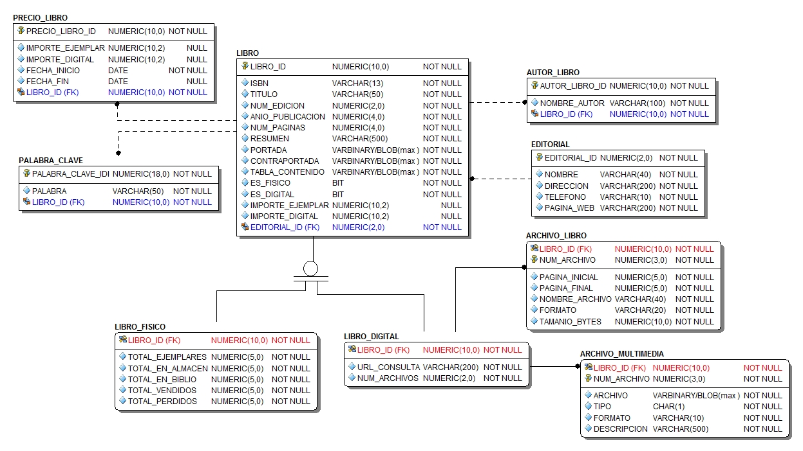

# SchoolBook
## schoolbook-libros.
* Este servicio se encarga de realizar la administración del acervo de libros que ofrece SchoolBook. Este acervo está formado tanto por libros en físico como por libros digitales.
* El servicio también realiza el control del histórico de sus precios de venta así como su precio actual. 
* La definición del caso de estudio completo se puede revisar en este [enlace](https://github.com/school-book/schoolbook-app)
### Entidades principales
* Libro
* Libro físico
* Libro digital
* Autor
* Editorial
### Modelo relacional

* Notar el uso de una jerarquía para realizar la separación entre los atributos de un libro físico y uno digital. 
* Las tablas adicionales se encargan de almacenar datos como son archivos multimedia, los archivos que forman a un libro digital, su lista de autores, palabras clave de búsqueda  y su histórico de precios.

